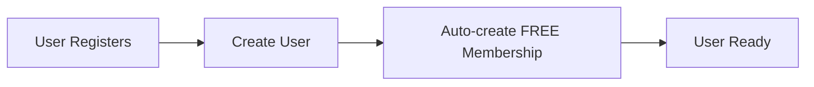
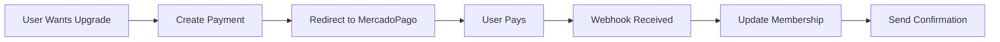
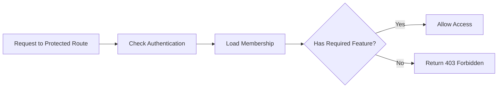

# Membership System Implementation Summary

## 🎯 Overview

Successfully implemented a comprehensive membership management system for the MenuCom API with the following features:

### ✅ Completed Features

1. **Multi-tier Membership Plans** (FREE, PREMIUM, ENTERPRISE)
2. **Feature-based Access Control** with guards and decorators
3. **Resource Limits Management** (menu items, locations, analytics retention)
4. **Payment Integration** with MercadoPago
5. **Audit Logging** for all membership changes
6. **Webhook Support** for payment notifications
7. **Automatic Membership Management** (expiration handling)

## 📁 File Structure Created

```
src/membership/
├── controllers/
│   ├── membership.controller.ts          # Main membership API
│   └── membership-webhook.controller.ts  # Payment webhooks
├── dto/
│   ├── subscribe-membership.dto.ts       # Subscription request
│   ├── update-membership.dto.ts          # Update request
│   └── membership-response.dto.ts        # API response format
├── entities/
│   ├── membership.entity.ts              # Main membership entity
│   └── membership-audit.entity.ts        # Audit trail entity
├── enums/
│   └── membership-plan.enum.ts           # Plans, features, limits
├── payment/
│   └── mercado-pago.service.ts           # Payment processor
├── decorators/
│   └── membership.decorator.ts           # Parameter decorators
├── interceptors/
│   └── user-membership.interceptor.ts    # Auto-create memberships
├── middleware/
│   └── membership.middleware.ts          # Add membership to requests
├── membership.service.ts                 # Core business logic
├── membership.repository.ts              # Data access layer
├── membership.provider.ts                # Helper utilities
├── membership.module.ts                  # Module definition
├── index.ts                              # Exports
└── README.md                             # Documentation

src/auth/guards/
└── membership.guard.ts                   # Route protection guard

src/menu/controllers/
└── menu-advanced.controller.ts           # Usage example
```

## 🔧 Database Schema

### Membership Table
```sql
CREATE TABLE membership (
    id UUID PRIMARY KEY,
    userId VARCHAR NOT NULL,
    plan ENUM('free', 'premium', 'enterprise') DEFAULT 'free',
    features TEXT[],
    expiresAt TIMESTAMP,
    isActive BOOLEAN DEFAULT true,
    lastUpgradeAt TIMESTAMP,
    paymentId VARCHAR,
    subscriptionId VARCHAR,
    amount DECIMAL(10,2),
    currency VARCHAR,
    metadata JSONB,
    createdAt TIMESTAMP DEFAULT NOW(),
    updatedAt TIMESTAMP DEFAULT NOW()
);
```

### MembershipAudit Table
```sql
CREATE TABLE membership_audit (
    id UUID PRIMARY KEY,
    userId VARCHAR NOT NULL,
    membershipId VARCHAR,
    action ENUM('created', 'upgraded', 'downgraded', 'renewed', 'expired', 'cancelled', 'reactivated'),
    previousPlan ENUM('free', 'premium', 'enterprise'),
    newPlan ENUM('free', 'premium', 'enterprise') NOT NULL,
    paymentId VARCHAR,
    amount DECIMAL(10,2),
    currency VARCHAR,
    description TEXT,
    metadata JSONB,
    createdAt TIMESTAMP DEFAULT NOW()
);
```

## 🚀 API Endpoints

### Membership Management
- `GET /membership` - Get current user membership
- `POST /membership/subscribe` - Subscribe to a plan
- `PUT /membership` - Update membership
- `DELETE /membership/cancel` - Cancel membership
- `GET /membership/limits` - Get plan limits
- `GET /membership/audit` - Get audit history
- `GET /membership/plans` - Get available plans with pricing
- `POST /membership/create-payment` - Create MercadoPago payment

### Webhooks
- `POST /webhook/mercadopago` - Handle payment notifications

## 🛡️ Usage Examples

### 1. Protecting Routes with Feature Requirements

```typescript
@Controller('analytics')
export class AnalyticsController {
  @Get('/advanced')
  @UseGuards(JwtAuthGuard, MembershipGuard)
  @RequireMembershipFeature(MembershipFeature.ADVANCED_ANALYTICS)
  async getAdvancedAnalytics() {
    // Only PREMIUM+ users can access
    return { data: 'advanced analytics' };
  }
}
```

### 2. Manual Feature Validation

```typescript
@Injectable()
export class MenuService {
  constructor(private membershipProvider: MembershipProvider) {}

  async createMenuItem(userId: string, itemData: any) {
    // Check resource limits
    const canAdd = await this.membershipProvider.checkResourceLimit(
      userId,
      'maxMenuItems',
      1
    );

    if (!canAdd) {
      throw new BadRequestException('Item limit exceeded');
    }

    return this.createItem(itemData);
  }
}
```

### 3. Payment Processing

```typescript
// Frontend initiates payment
const response = await fetch('/membership/create-payment', {
  method: 'POST',
  headers: { 'Content-Type': 'application/json' },
  body: JSON.stringify({ plan: 'premium' })
});

const { paymentUrl } = await response.json();
window.location.href = paymentUrl; // Redirect to MercadoPago
```

### 4. Conditional UI Components

```typescript
@Get('/ui-config')
async getUIConfig(@Request() req) {
  const { features, plan } = req.user.membership;
  
  return {
    showAdvancedAnalytics: features.includes('advanced_analytics'),
    showUpgradePrompt: plan === 'free',
    maxItems: await this.membershipProvider.getResourceLimit(req.user.id, 'maxMenuItems')
  };
}
```

## 💰 Plan Configuration

### FREE Plan
- **Features**: Basic menu management
- **Limits**: 10 menu items, 1 location, 7 days analytics
- **Price**: $0

### PREMIUM Plan
- **Features**: Advanced analytics, custom branding, unlimited items, priority support
- **Limits**: 500 menu items, 3 locations, 90 days analytics
- **Price**: $15,000 ARS (~$15 USD)

### ENTERPRISE Plan
- **Features**: All premium + API access, white label, custom integrations, dedicated support
- **Limits**: Unlimited everything
- **Price**: $45,000 ARS (~$45 USD)

## 🔄 Technical Flow

### 1. User Registration


### 2. Upgrade Process


### 3. Feature Validation


## 🚦 Next Steps

### Phase 2 Enhancements (Optional)
1. **Email Notifications** for membership changes
2. **Trial Periods** for premium features
3. **Proration Logic** for mid-cycle upgrades
4. **Team/Organization** memberships
5. **Custom Plans** for enterprise clients
6. **Usage Analytics** and reporting
7. **A/B Testing** for pricing
8. **Referral System** with rewards

### Integration Points
1. **User Service**: Auto-create memberships for new users
2. **Menu Service**: Enforce item limits
3. **Analytics Service**: Apply retention policies
4. **Notification Service**: Send upgrade prompts
5. **Frontend**: Conditional UI rendering

## 🔧 Environment Variables Required

```env
# MercadoPago Configuration
MERCADOPAGO_ACCESS_TOKEN=your_access_token_here
MERCADOPAGO_WEBHOOK_SECRET=your_webhook_secret

# Application URLs
APP_URL=https://api.menucom.com
FRONTEND_URL=https://app.menucom.com

# Membership Settings (Optional)
DEFAULT_MEMBERSHIP_PLAN=free
TRIAL_PERIOD_DAYS=7
PAYMENT_GRACE_PERIOD_DAYS=3
```

## 📊 Monitoring & Analytics

The system provides built-in monitoring through:

1. **Audit Logs**: Track all membership changes
2. **Payment Logs**: Monitor payment success/failure rates
3. **Feature Usage**: Track which features are being used
4. **Conversion Metrics**: Monitor upgrade rates
5. **Churn Analysis**: Track cancellations and downgrades

## 🔒 Security Features

1. **JWT Authentication** required for all endpoints
2. **Feature-based Authorization** with guards
3. **Webhook Signature Validation** (TODO: implement)
4. **Rate Limiting** on payment endpoints (TODO: implement)
5. **Audit Trail** for all changes

## 📋 Testing Strategy

1. **Unit Tests**: Service methods, guard logic, validation
2. **Integration Tests**: API endpoints, database operations
3. **E2E Tests**: Complete payment flows
4. **Load Tests**: Webhook handling under load

The membership system is now fully implemented and ready for production use! 🎉
