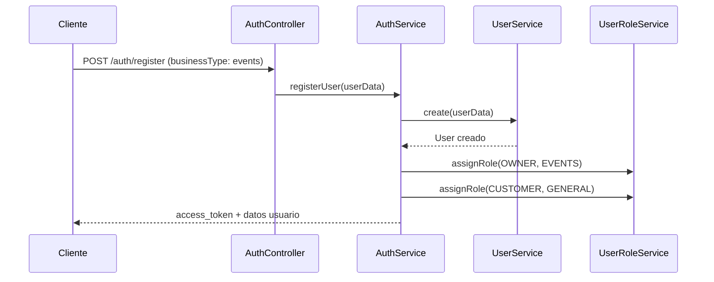
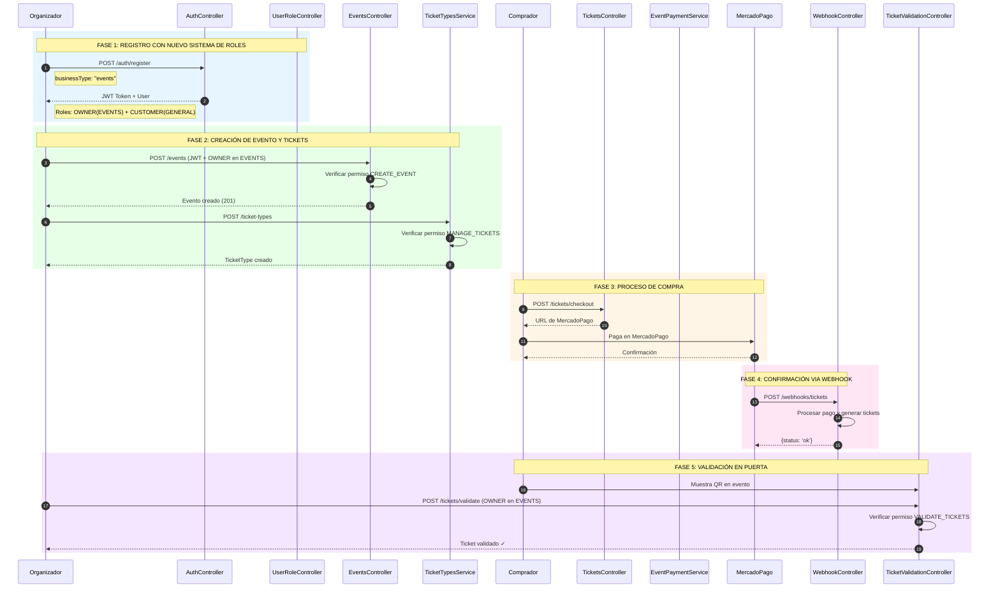

# Flujo Completo de Eventos - Documentación Técnica

## Índice
1. [Visión General](#visión-general)
2. [Registro de Organizador](#registro-de-organizador)
3. [Sistema de Roles y Contextos](#sistema-de-roles-y-contextos)
4. [Creación de Eventos](#creación-de-eventos)
5. [Gestión de Tipos de Tickets](#gestión-de-tipos-de-tickets)
6. [Flujo de Compra](#flujo-de-compra)
7. [Procesamiento de Webhook](#procesamiento-de-webhook)
8. [Generación y Validación de Tickets](#generación-y-validación-de-tickets)
9. [Diagrama de Secuencia](#diagrama-de-secuencia)
10. [Migración de Usuarios Existentes](#migración-de-usuarios-existentes)

---

## Visión General

El sistema de eventos permite a los organizadores crear y gestionar eventos, vender tickets y validar el acceso a través de códigos QR. El flujo completo incluye:

1. **Autenticación** - Registro/login de usuarios
2. **Autorización** - Asignación de roles (OWNER en EVENTS)
3. **Gestión de Eventos** - Creación y configuración
4. **Venta de Tickets** - Compra con MercadoPago
5. **Webhooks** - Confirmación de pagos
6. **Validación** - Escaneo de QR en puerta

---

## Registro de Organizador

### ✅ NUEVO SISTEMA: Registro con BusinessType

Un organizador de eventos se registra como **OWNER** en el contexto **EVENTS**, no como `CUSTOMER` en `GENERAL`.

### 1. Registro Tradicional (Email/Contraseña)

**Endpoint:** `POST /auth/register`

```typescript
// ✅ Request body CORRECTO (nuevo sistema)
{
  "email": "organizador@eventos.com",
  "name": "Juan Pérez",
  "password": "password123",
  "businessType": "events"  // ← NUEVO CAMPO
}

// ⚠️ Request body ANTERIOR (legacy, aún funciona)
{
  "email": "organizador@eventos.com",
  "name": "Juan Pérez",
  "password": "password123",
  "role": "event_organizer"
}
```

**Roles asignados automáticamente:**

| Rol | Contexto | Propósito |
|-----|----------|-----------|
| `OWNER` | `EVENTS` | Crear y gestionar eventos |
| `CUSTOMER` | `GENERAL` | Comprar tickets de otros eventos |

**Flujo Interno:**



**Proceso detallado:**

1. **AuthController** recibe los datos del usuario con `businessType: 'events'`
2. **AuthService.registerUser()** procesa el registro
3. Se determina el mapeo: `'events'` → `{ role: OWNER, context: EVENTS }`
4. **UserService.create()** crea el usuario en base de datos
5. Se asignan **DOS roles**:
   - `OWNER` en `EVENTS` (para crear eventos)
   - `CUSTOMER` en `GENERAL` (para comprar en otros negocios)
6. Se retorna token JWT para autenticación

### 2. Registro Social (Firebase/Google)

**Endpoint:** `POST /auth/social/login` (o `/auth/social/register`)

```typescript
// ✅ NUEVO: Puedes incluir businessType en los datos sociales
POST /auth/social/login
Header: Authorization: Bearer <Firebase ID Token>
Body: {
  "businessType": "events"  // Opcional
}

// Response
{
  "access_token": "jwt_token...",
  "user": {
    "id": "uuid...",
    "email": "organizador@gmail.com",
    "name": "Juan Pérez",
    "role": "owner"  // ← Ahora es 'owner', no 'customer'
  }
}
```

**Flujo Interno:**

1. **GoogleIdTokenStrategy** valida el token de Firebase
2. **AuthService.loginSocial()** busca usuario por `socialToken` (Firebase UID)
3. Si no existe, busca por email
4. Si aún no existe, crea nuevo usuario con **UserAuthService.createOfSocial()**
5. Si se proporcionó `businessType`, se asigna el rol correspondiente
6. Si no se proporcionó, se asigna `CUSTOMER` en `GENERAL` por defecto
7. Retorna JWT del sistema

---

## Sistema de Roles y Contextos

### Concepto de Contexto

Un **contexto** es un dominio de negocio aislado donde un usuario puede tener diferentes capacidades:

```typescript
enum BusinessContext {
  GENERAL = 'general',       // Sistema completo (administración)
  RESTAURANT = 'restaurant', // Negocios de comida
  WARDROBE = 'wardrobe',     // Guardarropas/ropa
  MARKETPLACE = 'marketplace', // Tiendas/Marketplaces
  EVENTS = 'events',         // Eventos y tickets ← Para organizadores
}
```

### Jerarquía de Roles

```typescript
enum RoleType {
  ADMIN = 'admin',           // Control total (en su contexto)
  OWNER = 'owner',           // Dueño del negocio ← Organizador de eventos
  MANAGER = 'manager',       // Gerente (subordinado al OWNER)
  EVENT_ORGANIZER = 'event_organizer', // ← DEPRECATED, usar OWNER en EVENTS
  CUSTOMER = 'customer',     // Cliente final (solo consume)
}
```

### Matriz Roles × Contextos para Eventos

| Rol | Contexto | Permisos |
|-----|----------|----------|
| **OWNER** | **EVENTS** | ✅ Crear/editar/eliminar eventos<br>✅ Gestionar tickets<br>✅ Validar entradas<br>✅ Ver analytics<br>✅ Gestionar pagos |
| EVENT_ORGANIZER | EVENTS | ✅ Mismos permisos (legacy) |
| ADMIN | EVENTS | ✅ Todos los permisos + gestionar otros usuarios |
| CUSTOMER | EVENTS | ✅ Ver eventos<br>✅ Comprar tickets |

### Identificar un Organizador de Eventos

```typescript
// En el código
const isOrganizer = await userRoleService.hasRole(
  userId,
  RoleType.OWNER,
  BusinessContext.EVENTS
);

// Usando el helper
const isOrganizer = await userRoleService.isEventOrganizer(userId);

// En SQL
SELECT u.email, u.name
FROM public.user u
INNER JOIN user_roles ur ON u.id = ur.user_id
WHERE ur.role = 'owner' 
  AND ur.context = 'events'
  AND ur.is_active = true;
```

---

## Asignación de Roles

### Sistema de Roles Moderno vs Legacy

El sistema usa un modelo **dual**:

1. **Legacy (User.role):** Campo en tabla user (customer, admin, etc.)
   - Se mantiene por backward compatibility
   - No se usa para permisos

2. **Moderno (UserRole entity):** Tabla `user_roles` con contextos y permisos granulares
   - Sistema principal de autorización
   - Un usuario puede tener múltiples roles en diferentes contextos

### Permisos para Eventos

```typescript
// src/auth/models/permissions.model.ts
[BusinessContext.EVENTS]: {
  [RoleType.OWNER]: [  // ← NUEVO: Dueño de negocio de eventos
    Permission.CREATE_EVENT,
    Permission.READ_EVENT,
    Permission.UPDATE_EVENT,
    Permission.DELETE_EVENT,
    Permission.MANAGE_TICKETS,
    Permission.VALIDATE_TICKETS,
    Permission.VIEW_ANALYTICS,
    Permission.MANAGE_PAYMENTS,
  ],
  [RoleType.EVENT_ORGANIZER]: [  // ← Mantenido por backward compat
    Permission.CREATE_EVENT,
    Permission.READ_EVENT,
    // ... mismos permisos
  ],
  [RoleType.ADMIN]: [...],
  [RoleType.CUSTOMER]: [
    Permission.READ_EVENT,
    Permission.CREATE_ORDER,
    Permission.READ_ORDER,
  ],
}
```

### Asignar Rol de Organizador Manualmente

**Endpoint:** `POST /user-roles/assign` (Requiere permisos MANAGE_USERS)

```typescript
// Request body
{
  "userId": "uuid-del-usuario",
  "role": "owner",           // ← 'owner', no 'event_organizer'
  "context": "events",       // ← 'events', no 'general'
  "resourceId": null         // Opcional: específico evento
}
```

**Nota:** Un usuario con rol `OWNER` en `EVENTS` puede crear múltiples eventos.

---

## Creación de Eventos

### Requisitos Previos

El usuario debe tener:
- ✅ Rol `OWNER` en contexto `EVENTS`
- O rol `ADMIN` con permisos de eventos
- O rol `EVENT_ORGANIZER` (legacy, aún funciona)

### Crear Evento

**Endpoint:** `POST /events`

```typescript
// Request body (CreateEventDto)
{
  "name": "Concierto de Rock 2026",
  "description": "El mejor concierto del año",
  "startDate": "2026-06-15T20:00:00Z",
  "endDate": "2026-06-16T02:00:00Z",
  "venueId": "uuid-venue-existente", // Opcional
  "venue": {                        // O crear nuevo venue
    "name": "Estadio Nacional",
    "address": "Av. Principal 123",
    "capacity": 50000
  }
}
```

### Verificación de Permisos

El controlador verifica automáticamente:

```typescript
@Controller('events')
export class EventsController {
  
  @Post()
  @UseGuards(JwtAuthGuard, PermissionsGuard)
  @InBusinessContext(BusinessContext.EVENTS)
  @RequirePermissions(Permission.CREATE_EVENT)
  async create(@Request() req, @Body() createEventDto: CreateEventDto) {
    // Solo usuarios con OWNER en EVENTS pueden crear
    const organizerId = req.user.userId;
    return await this.eventsService.create(createEventDto, tenantId, organizerId);
  }
}
```

---

## Gestión de Tipos de Tickets

### Crear Tipo de Ticket

**Endpoint:** `POST /ticket-types`

```typescript
// Request body
{
  "eventId": "uuid-del-evento",
  "name": "Entrada General",
  "price": 1500.00,
  "totalQuantity": 1000,
  "saleStartDate": "2026-01-01T00:00:00Z",
  "saleEndDate": "2026-06-14T23:59:59Z",
  "maxPerUser": 10
}
```

**Permisos requeridos:** `MANAGE_TICKETS` en contexto `EVENTS`

Los usuarios con rol `OWNER` en `EVENTS` tienen automáticamente este permiso.

---

## Flujo de Compra

### Iniciar Proceso de Pago

**Endpoint:** `POST /tickets/checkout`

```typescript
// Request body
{
  "ticketTypeId": "uuid-ticket-type",
  "quantity": 2,
  "customerName": "María García",
  "customerEmail": "maria@email.com",
  "tenantId": "uuid-organizador"
}
```

**Nota:** Cualquier usuario con rol `CUSTOMER` (en cualquier contexto) puede comprar tickets.

Los organizadores que tienen `OWNER` en `EVENTS` **TAMBIÉN** tienen `CUSTOMER` en `GENERAL`, por lo que pueden comprar tickets de otros eventos.

---

## Procesamiento de Webhook

El webhook de MercadoPago no requiere autenticación JWT. Procesa pagos y genera tickets automáticamente.

**URL:** `POST /webhooks/tickets`

El proceso es igual independientemente del tipo de usuario:
- Recibe notificación de MercadoPago
- Valida firma HMAC
- Genera tickets
- Notifica al comprador

---

## Generación y Validación de Tickets

### Validación de Tickets

**Endpoint:** `POST /tickets/validate`

```typescript
// Request body
{
  "qrCode": "qr-code-string",
  "mode": "online" // o "offline"
}
```

**Permisos requeridos:** `VALIDATE_TICKETS` o `MANAGE_TICKETS` en contexto `EVENTS`

Los usuarios con `OWNER` en `EVENTS` pueden validar tickets de sus propios eventos.

### Validación por Evento Específico (con resourceId)

Si se usa `resourceId` para aislar por evento:

```typescript
// El organizador solo puede validar tickets de sus eventos
const canValidate = await userRoleService.hasRole(
  userId,
  RoleType.OWNER,
  BusinessContext.EVENTS,
  eventId // ← Solo este evento específico
);
```

---

## Diagrama de Secuencia Completo



---

## Migración de Usuarios Existentes

### Problema

Los usuarios existentes que se registraron antes de los cambios pueden tener:
- `CUSTOMER` en `GENERAL` (incorrecto para organizadores)
- `EVENT_ORGANIZER` en `EVENTS` (legacy, funciona pero no ideal)

### Solución

Ejecutar script de migración:

```bash
# 1. Backup
pg_dump $POSTGRESQL_URL > backup_pre_role_migration.sql

# 2. Migrar
npm run migrate:roles
```

El script detectará automáticamente:
- Usuarios con eventos → Asigna `OWNER` en `EVENTS`
- Usuarios con catálogos de restaurante → Asigna `OWNER` en `RESTAURANT`
- Usuarios admin → Asigna `ADMIN` en `GENERAL`
- Usuarios sin actividad comercial → Mantienen `CUSTOMER` en `GENERAL`

### Verificar Migración

```sql
-- Ver organizadores migrados
SELECT u.email, u.name, ur.role, ur.context, ur.granted_by
FROM public.user u
INNER JOIN user_roles ur ON u.id = ur.user_id
WHERE ur.role = 'owner' 
  AND ur.context = 'events'
  AND ur.granted_by = 'migration-script-2026';

-- Ver usuarios con doble rol (comerciantes que pueden comprar)
SELECT u.email, 
       STRING_AGG(ur.role || ' in ' || ur.context, ', ') as roles
FROM public.user u
INNER JOIN user_roles ur ON u.id = ur.user_id
GROUP BY u.id, u.email
HAVING COUNT(ur.id) > 1;
```

---

## Resumen de Endpoints

### Autenticación
| Método | Endpoint | Descripción |
|--------|----------|-------------|
| POST | `/auth/register` | Registro con `businessType` |
| POST | `/auth/login` | Login con email/password |
| POST | `/auth/social/login` | Login con Firebase/Google |

### Roles
| Método | Endpoint | Descripción |
|--------|----------|-------------|
| POST | `/user-roles/assign` | Asignar rol (requiere MANAGE_USERS) |
| GET | `/user-roles/my-roles` | Ver mis roles |
| GET | `/user-roles/my-permissions/:context` | Ver mis permisos |

### Eventos (Requiere OWNER en EVENTS)
| Método | Endpoint | Permiso Requerido |
|--------|----------|-------------------|
| POST | `/events` | CREATE_EVENT |
| GET | `/events` | READ_EVENT |
| PUT | `/events/:id` | UPDATE_EVENT |
| DELETE | `/events/:id` | DELETE_EVENT |

### Tickets (Requiere OWNER en EVENTS)
| Método | Endpoint | Permiso Requerido |
|--------|----------|-------------------|
| POST | `/ticket-types` | MANAGE_TICKETS |
| POST | `/tickets/validate` | VALIDATE_TICKETS |

---

## Consideraciones de Seguridad

1. **Validación de Permisos:** El sistema verifica `OWNER` en `EVENTS`, no solo autenticación
2. **Aislamiento:** Cada organizador solo ve/crea sus propios eventos
3. **Doble Rol:** Los comerciantes también son clientes, evitando duplicación de cuentas
4. **Backward Compatible:** Roles legacy siguen funcionando

---

## Notas de Implementación

- **Fecha de implementación:** 2026-05-14
- **Cambio principal:** `businessType` en lugar de `role` para determinar contexto
- **Rol para organizadores:** `OWNER` en `EVENTS` (reemplaza `EVENT_ORGANIZER`)
- **Script de migración:** `npm run migrate:roles`
- **Backward compatibility:** 100% - código legacy sigue funcionando

---

*Documento actualizado: 2026-05-14*
*Versión: 2.0 - Sistema de Roles y Contextos*
