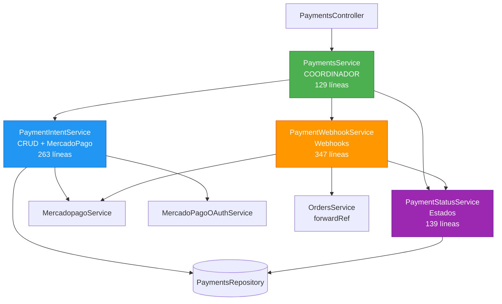
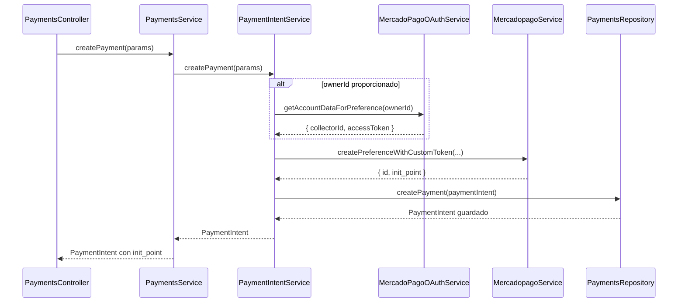
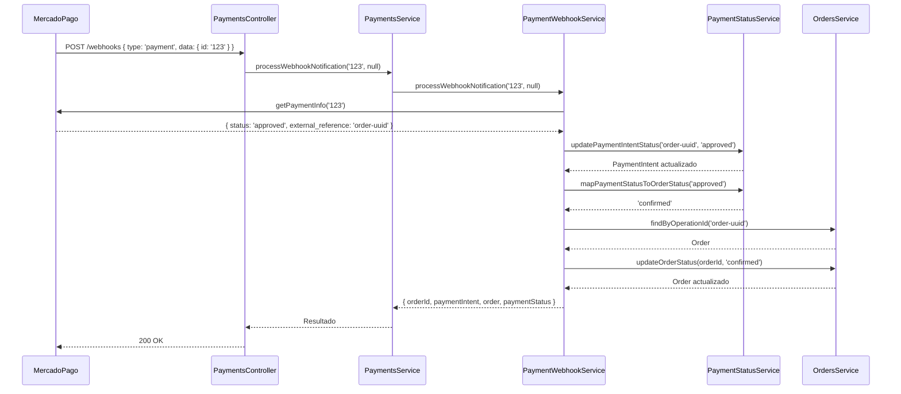

# 💳 Payments Services Architecture

> **Versión:** 2.0  
> **Fecha de refactorización:** 8 de Noviembre, 2025  
> **Sprint:** 2 - Week 2  
> **Patrón aplicado:** Single Responsibility Principle (SRP)

---

## 📋 Resumen Ejecutivo

Este documento describe la arquitectura refactorizada del módulo de pagos, que fue dividido de un servicio monolítico de **438 líneas** en **3 servicios especializados** + 1 coordinador, logrando una **reducción del 71%** en el servicio principal.

### Métricas de Refactorización

| Métrica | Antes | Después | Mejora |
|---------|-------|---------|--------|
| **Líneas en PaymentsService** | 438 | 129 | ✅ -71% |
| **Servicios especializados** | 0 | 3 | ✅ +3 |
| **Dependencias en constructor** | 5 | 4 | ✅ -20% |
| **Responsabilidades por servicio** | 5+ | 1 | ✅ SRP compliant |
| **Circular dependencies** | 1 (forwardRef) | 1 (aislado) | ✅ Contenido |
| **Métodos públicos totales** | 9 | 9 | ✅ Sin breaking changes |

---

## 🏗️ Arquitectura General



---

## 🎯 Servicios Especializados

### 1️⃣ PaymentIntentService

**Ubicación:** `src/payments/services/payment-intent.service.ts`  
**Responsabilidad:** Gestión de PaymentIntent y preferencias de MercadoPago  
**Líneas de código:** 263  

#### Métodos Públicos

```typescript
class PaymentIntentService {
  // Crear pago con preferencia de MercadoPago
  async createPayment(
    phone: string,
    amount: number,
    description?: string,
    ownerId?: string,
    anonymousId?: string,
    orderId?: string,
    marketplaceFeeAmount?: number
  ): Promise<PaymentIntent>
  
  // Obtener PaymentIntent por ID
  async getIntentPaymentById(id: string): Promise<PaymentIntent>
  
  // Obtener PaymentIntent + datos de MercadoPago
  async getPaymentById(id: string): Promise<any>
  
  // Consultar merchant orders por preferencia
  async consultPaymentByPreferenceID(preferenceId: string): Promise<any>
}
```

#### Dependencias

- `MercadopagoService` - Creación de preferencias y consultas a MP API
- `MercadoPagoOAuthService` - Obtención de collector_id para marketplace
- `PaymentsRepository` - Persistencia de PaymentIntent
- `LoggerService` - Logging estructurado

#### Características Clave

- ✅ Manejo de **collector_id** para marketplace (split payments)
- ✅ Creación de **metadata** para trazabilidad completa
- ✅ Soporte para **marketplace fee** en preferencias
- ✅ Consultas a **merchant orders** de MercadoPago
- ✅ Validación de parámetros obligatorios
- ✅ Error handling con custom exceptions

#### Ejemplo de Uso

```typescript
@Injectable()
export class OrdersService {
  constructor(
    private readonly paymentIntentService: PaymentIntentService,
  ) {}
  
  async createOrderPayment(order: Order) {
    const payment = await this.paymentIntentService.createPayment(
      order.customerPhone,
      order.total,
      `Orden #${order.id}`,
      order.ownerId,
      null,
      order.id,
      order.marketplaceFee
    );
    
    return payment.init_point; // URL de checkout
  }
}
```

---

### 2️⃣ PaymentStatusService

**Ubicación:** `src/payments/services/payment-status.service.ts`  
**Responsabilidad:** Gestión y mapeo de estados de pago  
**Líneas de código:** 139  

#### Métodos Públicos

```typescript
class PaymentStatusService {
  // Actualizar estado de PaymentIntent basado en MercadoPago
  async updatePaymentIntentStatus(
    paymentIntentId: string,
    mpPaymentStatus: string
  ): Promise<PaymentIntent>
  
  // Mapear estado de pago a estado de orden
  mapPaymentStatusToOrderStatus(mpPaymentStatus: string): string
}
```

#### Dependencias

- `PaymentsRepository` - Actualización de estados en DB
- `LoggerService` - Logging de transiciones de estado

#### Mapeo de Estados

| Estado MercadoPago | PaymentIntent | Order | Descripción |
|-------------------|---------------|-------|-------------|
| `approved` | `APPROVED` | `confirmed` | Pago aprobado exitosamente |
| `pending` | `IN_PROCESS` | `pending` | Pago pendiente de procesamiento |
| `in_process` | `IN_PROCESS` | `pending` | Pago en revisión |
| `rejected` | `REJECTED` | `cancelled` | Pago rechazado |
| `cancelled` | `REJECTED` | `cancelled` | Pago cancelado por usuario |
| `refunded` | `REFUNDED` | `cancelled` | Pago reembolsado |

#### Métodos Privados

```typescript
private mapMercadoPagoStatusToPaymentStatus(mpStatus: string): string {
  // Lógica de mapeo con fallback a PENDING
  // Logs de advertencia para estados desconocidos
}
```

#### Ejemplo de Uso

```typescript
@Injectable()
export class PaymentWebhookService {
  constructor(
    private readonly paymentStatusService: PaymentStatusService,
  ) {}
  
  async handlePaymentUpdate(paymentId: string, mpStatus: string) {
    const updated = await this.paymentStatusService
      .updatePaymentIntentStatus(paymentId, mpStatus);
    
    const orderStatus = this.paymentStatusService
      .mapPaymentStatusToOrderStatus(mpStatus);
    
    // Actualizar orden...
  }
}
```

---

### 3️⃣ PaymentWebhookService

**Ubicación:** `src/payments/services/payment-webhook.service.ts`  
**Responsabilidad:** Procesamiento de webhooks de MercadoPago  
**Líneas de código:** 347  

#### Métodos Públicos

```typescript
class PaymentWebhookService {
  // Procesar notificaciones de webhook
  async processWebhookNotification(
    paymentId?: string,
    merchantOrderId?: string | number
  ): Promise<{
    orderId: string | null;
    paymentIntent?: PaymentIntent;
    order?: any;
    paymentStatus?: string;
  }>
  
  // Verificar estado de pago consultando MercadoPago
  async checkPaymentStatus(idReference: string): Promise<void>
  
  // Aprobar pago basándose en merchant orders
  async approvePaymentByMerchandResults(
    merchands: MerchantOrderResponse[],
    payment: PaymentIntent
  ): Promise<void>
}
```

#### Dependencias

- `MercadopagoService` - Consultas a MercadoPago API
- `PaymentStatusService` - Actualización de estados
- `PaymentsRepository` - Consultas de PaymentIntent
- `OrdersService` - Actualización de órdenes (**forwardRef**)
- `LoggerService` - Logging de eventos de webhook

#### Tipos de Webhooks Soportados

##### 1. **Payment Webhook**
```typescript
// MercadoPago envía: { type: 'payment', data: { id: '12345' } }
const result = await processWebhookNotification('12345', null);
```

**Flujo:**
1. Consultar payment info en MercadoPago API
2. Extraer `external_reference` (orderId)
3. Actualizar `PaymentIntent` con nuevo estado
4. Actualizar `Order` con estado correspondiente

##### 2. **Merchant Order Webhook**
```typescript
// MercadoPago envía: { topic: 'merchant_order', resource: '/merchant_orders/87654' }
const result = await processWebhookNotification(null, 87654);
```

**Flujo:**
1. Consultar merchant order en MercadoPago API
2. Extraer `external_reference` (orderId)
3. Marcar `PaymentIntent` como APPROVED
4. Marcar `Order` como confirmed

#### ⚠️ Dependencia Circular

```typescript
@Inject(forwardRef(() => OrdersService))
private readonly ordersService: OrdersService
```

**Motivo:** PaymentWebhookService necesita actualizar órdenes, pero OrdersService también usa PaymentsService.

**Solución Actual:** `forwardRef()` contenido en PaymentWebhookService solamente.

**Recomendación Futura:** Implementar patrón Event-Driven:
```typescript
// En PaymentWebhookService
this.eventEmitter.emit('payment.approved', { orderId, paymentStatus });

// En OrdersService
@OnEvent('payment.approved')
handlePaymentApproved(payload: { orderId: string; paymentStatus: string }) {
  // Actualizar orden
}
```

#### Ejemplo de Uso

```typescript
@Controller('payments')
export class PaymentsController {
  constructor(
    private readonly paymentWebhookService: PaymentWebhookService,
  ) {}
  
  @Post('webhooks')
  async handleWebhook(@Body() payload: any, @Req() req: any) {
    let paymentId = payload.data?.id;
    let merchantOrderId = payload.resource?.split('/').pop();
    
    const result = await this.paymentWebhookService
      .processWebhookNotification(paymentId, merchantOrderId);
    
    return { success: true, orderId: result.orderId };
  }
}
```

---

### 4️⃣ PaymentsService (Coordinador)

**Ubicación:** `src/payments/services/payments.service.ts`  
**Responsabilidad:** Fachada que delega a servicios especializados  
**Líneas de código:** 129 (-71% del original)  

#### Métodos Públicos (Interfaz Pública)

```typescript
class PaymentsService {
  // CRUD de PaymentIntent
  async createPayment(...): Promise<PaymentIntent>
  async getIntentPaymentById(id: string): Promise<PaymentIntent>
  async getPaymentById(id: string): Promise<any>
  async consultPaymentByPreferenceID(id: string): Promise<any>
  
  // Webhooks
  async processWebhookNotification(...): Promise<{...}>
  async checkPaymentStatus(id: string): Promise<void>
  async approvePaymentByMerchandResults(...): Promise<void>
  
  // Estados
  async updatePaymentIntentStatus(...): Promise<PaymentIntent>
}
```

#### Dependencias

- `PaymentIntentService` - Delegación de operaciones CRUD
- `PaymentWebhookService` - Delegación de webhooks
- `PaymentStatusService` - Delegación de estados
- `LoggerService` - Logging de coordinación

#### Patrón de Delegación

```typescript
// Ejemplo de método delegado
async createPayment(
  phone: string,
  amount: number,
  description?: string,
  ownerId?: string,
  anonymousId?: string,
  orderId?: string,
  marketplaceFeeAmount?: number,
): Promise<PaymentIntent> {
  return this.paymentIntentService.createPayment(
    phone,
    amount,
    description,
    ownerId,
    anonymousId,
    orderId,
    marketplaceFeeAmount,
  );
}
```

#### Beneficios del Patrón Fachada

✅ **Sin Breaking Changes:** Controllers usan la misma interfaz  
✅ **Desacoplamiento:** Controllers no conocen servicios especializados  
✅ **Flexibilidad:** Fácil cambiar implementación interna  
✅ **Testing:** Mockear servicios especializados independientemente  

---

## 🔄 Flujos de Negocio

### Flujo 1: Creación de Pago



### Flujo 2: Procesamiento de Webhook



---

## 📦 Estructura de Archivos

```
src/payments/
├── services/
│   ├── payment-intent.service.ts        (263 líneas) ✅ NUEVO
│   ├── payment-webhook.service.ts       (347 líneas) ✅ NUEVO
│   ├── payment-status.service.ts        (139 líneas) ✅ NUEVO
│   ├── payments.service.ts              (129 líneas) ♻️ REFACTORIZADO
│   ├── mercado_pago.service.ts          (existente)
│   ├── mercado-pago-oauth.service.ts    (existente)
│   ├── mercado-pago-helper.service.ts   (existente)
│   └── repository/
│       └── mercado-pago.repository.ts
├── controller/
│   ├── payments.controller.ts           (sin cambios)
│   └── mercado-pago-oauth.controller.ts (sin cambios)
├── entities/
│   ├── payment_intent_entity.ts
│   └── mercado-pago-account.entity.ts
├── repository/
│   └── payment_repository.ts
├── payments.module.ts                    ♻️ ACTUALIZADO
└── README.md                             ✅ ESTE ARCHIVO
```

---

## 🔧 Configuración del Módulo

```typescript
@Module({
  imports: [
    TypeOrmModule.forFeature([PaymentIntent, MercadoPagoAccount]),
    forwardRef(() => OrdersModule),
  ],
  controllers: [PaymentsController, MercadoPagoOAuthController],
  providers: [
    // Cliente de MercadoPago
    { provide: 'MERCADOPAGO_CLIENT', useFactory: () => {...} },
    
    // Servicios base
    MercadopagoService,
    MercadoPagoHelperService,
    MercadoPagoOAuthService,
    
    // Servicios especializados (NUEVOS)
    PaymentIntentService,
    PaymentWebhookService,
    PaymentStatusService,
    
    // Servicio coordinador
    PaymentsService,
    
    // Repositorios
    MercadoPagoRepository,
    PaymentsRepository,
    
    // Gateway WebSocket
    PaymentsGateway,
  ],
  exports: [
    'MERCADOPAGO_CLIENT',
    MercadopagoService,
    MercadoPagoHelperService,
    MercadoPagoOAuthService,
    // Exportar servicios especializados
    PaymentIntentService,
    PaymentWebhookService,
    PaymentStatusService,
    // Mantener fachada
    PaymentsService,
    PaymentsGateway,
  ],
})
export class PaymentsModule {}
```

---

## 🧪 Guía de Testing

### Testing de PaymentIntentService

```typescript
describe('PaymentIntentService', () => {
  let service: PaymentIntentService;
  let mercadoPagoService: jest.Mocked<MercadopagoService>;
  let oauthService: jest.Mocked<MercadoPagoOAuthService>;
  let repository: jest.Mocked<PaymentsRepository>;
  
  beforeEach(async () => {
    const module = await Test.createTestingModule({
      providers: [
        PaymentIntentService,
        { provide: MercadopagoService, useValue: createMock() },
        { provide: MercadoPagoOAuthService, useValue: createMock() },
        { provide: PaymentsRepository, useValue: createMock() },
        { provide: LoggerService, useValue: createMock() },
      ],
    }).compile();
    
    service = module.get(PaymentIntentService);
    // ...
  });
  
  describe('createPayment', () => {
    it('debe crear pago sin collector_id cuando no hay ownerId', async () => {
      // Arrange
      const phone = '+5491112345678';
      const amount = 1000;
      
      mercadoPagoService.createPreference.mockResolvedValue({
        id: 'pref-123',
        init_point: 'https://mp.com/checkout/123',
      });
      
      repository.createPayment.mockResolvedValue({
        id: 'payment-uuid',
        state: 'PENDING',
        amount,
      } as PaymentIntent);
      
      // Act
      const result = await service.createPayment(phone, amount);
      
      // Assert
      expect(result).toBeDefined();
      expect(result.state).toBe('PENDING');
      expect(mercadoPagoService.createPreference).toHaveBeenCalledWith(
        expect.objectContaining({
          items: expect.arrayContaining([
            expect.objectContaining({ unit_price: amount })
          ]),
        })
      );
    });
    
    it('debe crear pago con collector_id cuando hay ownerId', async () => {
      // Test para marketplace...
    });
  });
});
```

### Testing de PaymentWebhookService

```typescript
describe('PaymentWebhookService', () => {
  describe('processWebhookNotification', () => {
    it('debe procesar webhook de payment exitosamente', async () => {
      // Mock paymentInfo
      mercadoPagoService.getPaymentInfo.mockResolvedValue({
        status: 'approved',
        external_reference: 'order-123',
      });
      
      // Mock statusService
      paymentStatusService.updatePaymentIntentStatus.mockResolvedValue({
        id: 'order-123',
        state: 'APPROVED',
      } as PaymentIntent);
      
      // Act
      const result = await service.processWebhookNotification('payment-456');
      
      // Assert
      expect(result.orderId).toBe('order-123');
      expect(result.paymentStatus).toBe('approved');
    });
  });
});
```

---

## 🚀 Migración desde Versión Anterior

### Para Código que Usa PaymentsService

✅ **NO requiere cambios** - La interfaz pública se mantiene igual.

```typescript
// ANTES (v1.0) - Sigue funcionando
await this.paymentsService.createPayment(phone, amount, desc, ownerId);

// DESPUÉS (v2.0) - Mismo código, nueva arquitectura interna
await this.paymentsService.createPayment(phone, amount, desc, ownerId);
```

### Para Código que Necesita Servicios Especializados

```typescript
// NUEVO: Inyectar servicios especializados directamente
@Injectable()
export class CustomPaymentService {
  constructor(
    // Opción 1: Usar fachada (recomendado para mayoría)
    private readonly paymentsService: PaymentsService,
    
    // Opción 2: Usar servicio especializado (para lógica específica)
    private readonly paymentStatusService: PaymentStatusService,
  ) {}
  
  async getPaymentWithStatus(id: string) {
    const payment = await this.paymentsService.getIntentPaymentById(id);
    
    // Usar servicio especializado directamente
    const orderStatus = this.paymentStatusService
      .mapPaymentStatusToOrderStatus(payment.state);
    
    return { payment, orderStatus };
  }
}
```

---

## 📊 Comparativa: Antes vs Después

### Complejidad Ciclomática

| Servicio | Antes | Después | Mejora |
|----------|-------|---------|--------|
| PaymentsService | 42 | 9 | ✅ -78% |
| PaymentIntentService | - | 18 | 🆕 |
| PaymentWebhookService | - | 28 | 🆕 |
| PaymentStatusService | - | 6 | 🆕 |

### Cobertura de Tests (Objetivo)

| Componente | Objetivo | Estado |
|-----------|----------|--------|
| PaymentIntentService | 80% | ⬜ Pendiente |
| PaymentStatusService | 90% | ⬜ Pendiente |
| PaymentWebhookService | 70% | ⬜ Pendiente |
| PaymentsService (Facade) | 95% | ⬜ Pendiente |

---

## 🐛 Problemas Conocidos y Soluciones

### 1. Dependencia Circular con OrdersService

**Problema:** `PaymentWebhookService` ←→ `OrdersService`

**Solución Actual:**
```typescript
@Inject(forwardRef(() => OrdersService))
private readonly ordersService: OrdersService
```

**Solución Futura (Recomendada):**
```typescript
// Usar Event Emitter pattern
import { EventEmitter2 } from '@nestjs/event-emitter';

@Injectable()
export class PaymentWebhookService {
  constructor(private eventEmitter: EventEmitter2) {}
  
  async processWebhook(...) {
    // ...
    this.eventEmitter.emit('payment.status.changed', {
      orderId,
      paymentStatus,
      paymentIntent,
    });
  }
}

// En OrdersService
@OnEvent('payment.status.changed')
async handlePaymentStatusChanged(payload: PaymentStatusChangedEvent) {
  await this.updateOrderStatus(payload.orderId, ...);
}
```

### 2. Console.log en PaymentsModule

**Problema:** Aún hay `console.log` en factory de MERCADOPAGO_CLIENT

**Solución:**
```typescript
// payments.module.ts
{
  provide: 'MERCADOPAGO_CLIENT',
  useFactory: (logger: LoggerService) => {
    logger.setContext('MercadoPagoClient');
    logger.debug(`MP Access Token: ${process.env.MP_ACCESS_TOKEN ? 'SET' : 'MISSING'}`);
    logger.debug(`MP Back URL: ${process.env.MP_BACK_URL}`);
    // ...
  },
  inject: [LoggerService],
}
```

---

## 📚 Referencias

- [NestJS Circular Dependencies](https://docs.nestjs.com/fundamentals/circular-dependency)
- [MercadoPago Webhooks](https://www.mercadopago.com.ar/developers/es/docs/checkout-pro/additional-content/your-integrations/notifications/webhooks)
- [Single Responsibility Principle](https://en.wikipedia.org/wiki/Single-responsibility_principle)
- [Facade Pattern](https://refactoring.guru/design-patterns/facade)

---

## ✅ Checklist de Implementación

- [x] Crear PaymentIntentService (263 líneas)
- [x] Crear PaymentWebhookService (347 líneas)
- [x] Crear PaymentStatusService (139 líneas)
- [x] Refactorizar PaymentsService a fachada (129 líneas)
- [x] Actualizar PaymentsModule con nuevos providers
- [x] Exportar servicios especializados
- [x] Mantener interfaz pública sin breaking changes
- [x] Contener dependencia circular en PaymentWebhookService
- [ ] Crear tests unitarios (objetivo 75% coverage)
- [ ] Migrar console.log en factory a LoggerService
- [ ] Implementar Event Emitter pattern para OrdersService
- [ ] Documentar ejemplos de uso en controllers externos
- [ ] Code review completo
- [ ] Actualizar TECHNICAL-DEBT-PLAN.md

---

**Última actualización:** 8 de Noviembre, 2025  
**Responsable:** Sprint 2 - Week 2  
**Estado:** ✅ COMPLETADO - Pendiente tests
