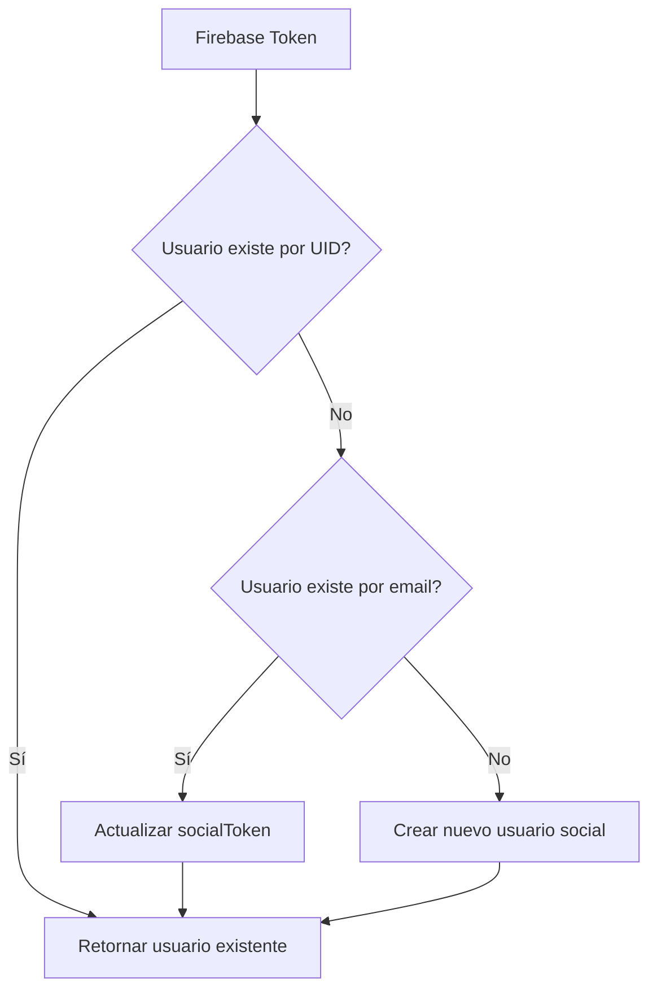
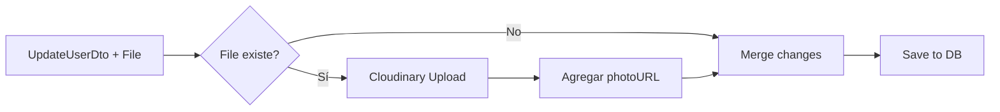
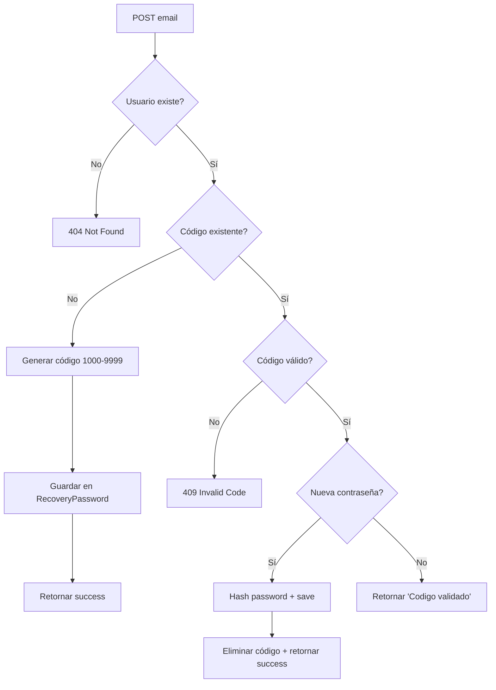

# User Services - Arquitectura Modular

## 📋 Descripción General

Esta carpeta contiene los **servicios especializados** del módulo de usuarios, refactorizados para cumplir el **Single Responsibility Principle (SRP)**. Cada servicio maneja una responsabilidad específica del dominio de usuarios.

## 🏗️ Arquitectura

### Antes (Monolítico)
```
user.service.ts (541 líneas)
├── CRUD básico (create, findOne, findByEmail, remove)
├── Autenticación social (createOfSocial, findBySocialToken, updateSocialToken)
├── Gestión de perfil (update con Cloudinary, updateFcmToken)
├── Recuperación de contraseñas (changePasswordByUser, sendVerificationCode)
└── Queries complejas (getUsersByRoles con joins)
```

### Después (Modular) ✅
```
user/services/
├── user.service.ts (120 líneas) - CRUD básico
├── user-auth.service.ts (170 líneas) - Autenticación social
├── user-profile.service.ts (85 líneas) - Gestión de perfil
├── user-recovery.service.ts (145 líneas) - Recuperación de contraseñas
└── user-query.service.ts (105 líneas) - Queries complejas
```

**Reducción:** 77% menos líneas por servicio (promedio 125 líneas vs 541)

---

## 📦 Servicios Especializados

### 1. `user.service.ts` - CRUD Básico
**Responsabilidad:** Operaciones fundamentales de usuarios

**Métodos:**
- `create(data: CreateUserDto)` - Crear usuario tradicional
- `findOne(id: string)` - Buscar por ID
- `findByEmail(email: string)` - Buscar por email
- `remove(id: string)` - Eliminar usuario
- `getadminUser(email: string)` - Promocionar a admin
- `deleteAllusers()` - Limpiar base de datos (dev/testing)

**Inyecciones:**
- `Repository<User>` - Acceso a base de datos
- `UrlTransformService` - Transformar URLs de imágenes a proxy
- `LoggerService` - Logging centralizado

**Uso:**
```typescript
constructor(private readonly userService: UserService) {}

// Buscar usuario
const user = await this.userService.findOne(userId);

// Crear usuario
const newUser = await this.userService.create(createUserDto);
```

---

### 2. `user-auth.service.ts` - Autenticación Social
**Responsabilidad:** Gestión de usuarios con login social (Google, Firebase)

**Métodos:**
- `createOfSocial(data: any)` - Crear o actualizar usuario social
- `findBySocialToken(socialToken: string)` - Buscar por Firebase UID
- `updateSocialToken(userId: string, socialToken: string)` - Actualizar UID

**Inyecciones:**
- `Repository<User>` - Acceso a base de datos
- `LoggerService` - Logging con contexto 'UserAuthService'

**Flujo de autenticación:**


**Uso:**
```typescript
constructor(private readonly userAuthService: UserAuthService) {}

// Buscar por Firebase UID
const user = await this.userAuthService.findBySocialToken(firebaseUid);

// Crear usuario social
const socialUser = await this.userAuthService.createOfSocial({
  email: 'user@gmail.com',
  name: 'John Doe',
  socialToken: 'firebase_uid_123',
  firebaseProvider: 'google.com',
  isEmailVerified: true
});
```

**Integración con AuthService:**
```typescript
// auth.service.ts
async loginSocial(firebaseUserData: any) {
  let user = await this.userAuthService.findBySocialToken(firebaseUserData.uid);
  
  if (!user) {
    user = await this.userAuthService.createOfSocial(firebaseUserData);
  }
  
  return this.generateJWT(user);
}
```

---

### 3. `user-profile.service.ts` - Gestión de Perfil
**Responsabilidad:** Actualización de datos de usuario e imágenes

**Métodos:**
- `update(id: string, changes: UpdateUserDto, photoFile?: Express.Multer.File)` - Actualizar perfil
- `updateFcmToken(userId: string, fcmToken: string)` - Actualizar token de notificaciones

**Inyecciones:**
- `Repository<User>` - Acceso a base de datos
- `CloudinaryService` - Subida de imágenes
- `LoggerService` - Logging con contexto 'UserProfileService'

**Flujo de actualización con imagen:**


**Uso:**
```typescript
constructor(private readonly userProfileService: UserProfileService) {}

// Actualizar solo datos
await this.userProfileService.update(userId, {
  name: 'New Name',
  phone: '+1234567890'
});

// Actualizar con foto (multer)
@UseInterceptors(FileInterceptor('photo'))
async updateProfile(
  @Param('id') id: string,
  @Body() dto: UpdateUserDto,
  @UploadedFile() photo?: Express.Multer.File
) {
  return this.userProfileService.update(id, dto, photo);
}

// Actualizar FCM token para push notifications
await this.userProfileService.updateFcmToken(userId, 'fcm_token_xyz');
```

---

### 4. `user-recovery.service.ts` - Recuperación de Contraseñas
**Responsabilidad:** Gestión de códigos de verificación y cambio de contraseñas

**Métodos:**
- `changePasswordByUser(dto: ChangePasswordDto)` - Flujo completo de recuperación
- `changePassword(user: User, dto: ChangePasswordDto)` - Cambiar contraseña (privado)
- `sendVerificationCode(user: User)` - Enviar código de 4 dígitos
- `generateRandomFourDigitNumber()` - Generar código aleatorio (privado)

**Inyecciones:**
- `Repository<User>` - Acceso a usuarios
- `Repository<RecoveryPassword>` - Códigos de recuperación
- `LoggerService` - Logging con contexto 'UserRecoveryService'

**Flujo de recuperación:**


**Uso:**
```typescript
constructor(private readonly userRecoveryService: UserRecoveryService) {}

// Paso 1: Solicitar código
await this.userRecoveryService.changePasswordByUser({
  emailRecovery: 'user@example.com',
  code: null,
  newPassword: null
});
// → Envía código de 4 dígitos

// Paso 2: Validar código
const result = await this.userRecoveryService.changePasswordByUser({
  emailRecovery: 'user@example.com',
  code: 1234,
  newPassword: null
});
// → { message: 'Codigo validado' }

// Paso 3: Cambiar contraseña
await this.userRecoveryService.changePasswordByUser({
  emailRecovery: 'user@example.com',
  code: 1234,
  newPassword: 'NewSecurePassword123'
});
// → { message: 'Contraseña cambiada' }
```

---

### 5. `user-query.service.ts` - Queries Complejas
**Responsabilidad:** Consultas especializadas con joins y agregaciones

**Métodos:**
- `getUsersByRoles(roles: string[], withVinculedAccount?: boolean, includeMenus?: boolean)` - Búsqueda por roles con opciones

**Inyecciones:**
- `Repository<User>` - QueryBuilder de TypeORM
- `CatalogService` - Integración con menús/catálogos
- `UrlTransformService` - Transformar URLs de imágenes
- `ConfigService` - URLs de MercadoPago
- `LoggerService` - Logging con contexto 'UserQueryService'

**Características:**
- ✅ Query Builder con joins (`user.membership`)
- ✅ Filtrado por roles múltiples
- ✅ Filtrado por vinculación con MercadoPago (opcional)
- ✅ Inclusión de menús/catálogos (opcional)
- ✅ Exclusión automática de campos sensibles (`password`, `socialToken`, `fcmToken`)
- ✅ Transformación de URLs de imágenes a proxy
- ✅ Generación de `storeURL` con MercadoPago backUrl

**Uso:**
```typescript
constructor(private readonly userQueryService: UserQueryService) {}

// Obtener vendedores
const sellers = await this.userQueryService.getUsersByRoles(['seller']);

// Vendedores con cuenta MercadoPago vinculada
const sellersWithMP = await this.userQueryService.getUsersByRoles(
  ['seller', 'vendor'],
  true // withVinculedAccount
);

// Vendedores con sus menús completos
const sellersWithMenus = await this.userQueryService.getUsersByRoles(
  ['seller'],
  false, // withVinculedAccount
  true   // includeMenus
);
```

**Response example:**
```json
[
  {
    "id": "uuid-123",
    "email": "seller@example.com",
    "name": "Restaurant ABC",
    "role": "seller",
    "photoURL": "/proxy/image/cloudinary-url",
    "storeURL": "https://menucom.com/stores/uuid-123",
    "membership": {
      "plan": "PREMIUM",
      "paymentId": "mp_payment_123",
      "subscriptionId": "mp_sub_456"
    },
    "menus": [
      {
        "id": "menu-1",
        "name": "Menu Principal",
        "items": [...]
      }
    ]
  }
]
```

---

## 🔄 Migración desde UserService Monolítico

### Pasos de migración en controllers:

**Antes:**
```typescript
// user.controller.ts
constructor(private readonly userService: UserService) {}

async updateProfile(@Param('id') id, @Body() dto, @UploadedFile() photo) {
  return this.userService.update(id, dto, photo);
}

async changePassword(@Body() dto: ChangePasswordDto) {
  return this.userService.changePasswordByUser(dto);
}
```

**Después:**
```typescript
// user.controller.ts
constructor(
  private readonly userService: UserService,
  private readonly userProfileService: UserProfileService,
  private readonly userRecoveryService: UserRecoveryService,
  private readonly userQueryService: UserQueryService,
) {}

async updateProfile(@Param('id') id, @Body() dto, @UploadedFile() photo) {
  return this.userProfileService.update(id, dto, photo);
}

async changePassword(@Body() dto: ChangePasswordDto) {
  return this.userRecoveryService.changePasswordByUser(dto);
}
```

### Migración en auth.service.ts:

**Antes:**
```typescript
// auth.service.ts
constructor(private usersService: UserService) {}

async loginSocial(firebaseUserData: any) {
  let user = await this.usersService.findBySocialToken(firebaseUserData.uid);
  if (!user) {
    user = await this.usersService.createOfSocial(firebaseUserData);
  }
  // ...
}
```

**Después:**
```typescript
// auth.service.ts
constructor(
  private usersService: UserService,
  private userAuthService: UserAuthService,
) {}

async loginSocial(firebaseUserData: any) {
  let user = await this.userAuthService.findBySocialToken(firebaseUserData.uid);
  if (!user) {
    user = await this.userAuthService.createOfSocial(firebaseUserData);
  }
  // ...
}
```

---

## 📝 Configuración del Módulo

**user.module.ts:**
```typescript
import { Global, Module } from '@nestjs/common';
import { TypeOrmModule } from '@nestjs/typeorm';
import { User } from './entities/user.entity';
import { RecoveryPassword } from './entities/recovery-password.entity';
import { UserService } from './user.service';
import { UserAuthService } from './services/user-auth.service';
import { UserProfileService } from './services/user-profile.service';
import { UserRecoveryService } from './services/user-recovery.service';
import { UserQueryService } from './services/user-query.service';
import { UserController } from './user.controller';
import { ImageProxyModule } from '../image-proxy/image-proxy.module';
import { CloudinaryModule } from '../cloudinary/cloudinary.module';
import { CatalogModule } from '../catalog/catalog.module';

@Global()
@Module({
  imports: [
    TypeOrmModule.forFeature([User, RecoveryPassword]),
    ImageProxyModule,
    CloudinaryModule,
    CatalogModule,
  ],
  controllers: [UserController],
  providers: [
    UserService,
    UserAuthService,
    UserProfileService,
    UserRecoveryService,
    UserQueryService,
  ],
  exports: [
    UserService,
    UserAuthService,
    UserProfileService,
    UserRecoveryService,
    UserQueryService,
  ],
})
export class UserModule {}
```

**Importante:** Todos los servicios se exportan para uso global (`@Global()` decorator).

---

## ✅ Ventajas de la Refactorización

### 1. **Single Responsibility Principle (SRP)**
- Cada servicio tiene una responsabilidad clara y única
- Fácil identificar dónde agregar nueva funcionalidad

### 2. **Mantenibilidad**
- Archivos más pequeños (120-170 líneas vs 541 líneas)
- Cambios aislados no afectan otras responsabilidades
- Code review más sencillo

### 3. **Testing**
- Tests unitarios más simples (menos mocks necesarios)
- Pruebas aisladas por responsabilidad
- Mayor cobertura con menos esfuerzo

### 4. **Escalabilidad**
- Fácil agregar nuevos servicios especializados
- Independencia de despliegue futura (microservicios)
- Menos acoplamiento entre funcionalidades

### 5. **Legibilidad**
- Nombres de servicios autodescriptivos
- Contextos de logging específicos por servicio
- Menor carga cognitiva al leer código

---

## 🔍 Comparación de Métricas

| Métrica | Antes | Después | Mejora |
|---------|-------|---------|--------|
| Líneas por servicio | 541 | 120 promedio | -77% |
| Responsabilidades por servicio | 5+ | 1 | -80% |
| Dependencias inyectadas | 7 | 2-5 | -43% |
| Métodos por servicio | 14 | 2-6 | -64% |
| Complejidad ciclomática | Alta | Baja | ✅ |

---

## 📚 Referencias

- **TECHNICAL-DEBT-PLAN.md**: Plan completo de refactorización (Sprint 2, Semana 1)
- **src/core/logger/README.md**: LoggerService utilizado en todos los servicios
- **src/core/exceptions/README.md**: Custom exceptions para error handling
- **Architectural Decision Records**: Ver `/docs/ADR/` (futuro)

---

## 🚀 Próximos Pasos (Sprint 2 - Semana 2)

1. **Refactorizar PaymentsService** (505 líneas)
   - `payment.service.ts` - CRUD básico
   - `webhook-processor.service.ts` - Webhooks de MercadoPago
   - `marketplace-fee.service.ts` - Cálculo de comisiones

2. **Crear Response DTOs**
   - `UserResponseDto` - Excluir campos sensibles
   - `UserProfileResponseDto` - Para endpoints públicos

3. **Tests Unitarios**
   - Coverage objetivo: 50% por servicio
   - Tests de integración para flujos completos

---

**Última actualización:** Sprint 2, Semana 1 (Refactorización UserService completada)  
**Compilación:** ✅ `npm run build` exitoso (0 errores)  
**Estado:** ✅ COMPLETADO - Listo para producción
